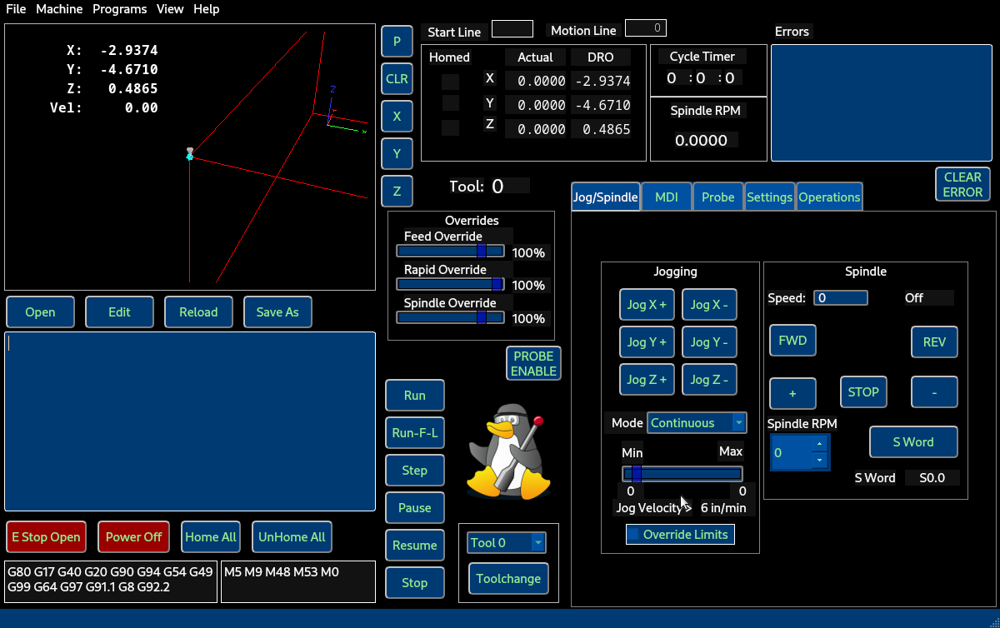

# Flex GUI

A flexible GUI for LinuxCNC

Flex GUI is a tool to build exactly the GUI you want for LinuxCNC.

* No complicated Qt Designer installs as it uses normal widgets
* No minimum required widgets
* Widget object names are used to connect the code to the widget
* Most Python status items are supported
* Plotter with controls
* Probing with safety for spindle and run controls and MDI controls

One of the example configurations

[Documents](https://gnipsel.com/linuxcnc/flexgui/index.html)
